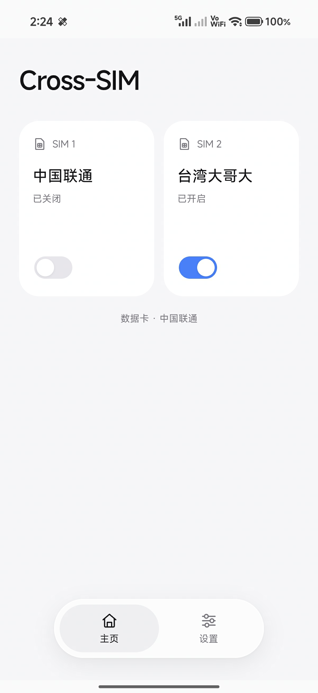
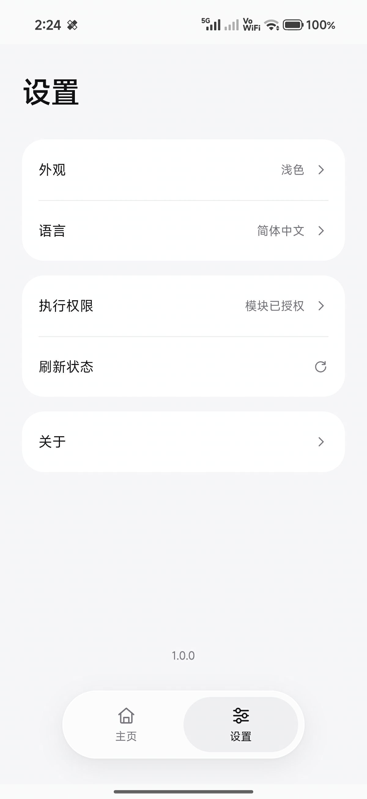

# Cross-SIM

管理跨卡通话（Cross-SIM Calling / Backup Calling）用户开关的模块，提供 WebUI。

## 开发原因

回台湾搞了个手机卡，在大陆只能用 Wifi Calling 打电话/接码，然后发现这沟槽的 WiFi Calling 真的只能在有 WiFi 的时候才能用，没网的时候就不能用。请教了万能的 AI 大人，发现了跨卡通话这个功能。翻遍了手机的设置项都没找到这个功能的开关，正巧手机在 38 解锁节 root 了，于是就有了这个模块。

## 功能

- 按卡槽显示系统报告的 SIM 名称、默认数据卡和 Cross-SIM 开关状态，可一键开关。
- 支持浅色、深色主题，以及中文、英文两种语言。

  
  

## 使用

在 root 管理器中安装模块 ZIP 即可。

- SukiSU / 提供 WebUI 的 KernelSU 管理器：打开 **Cross-SIM → WebUI**。
- Magisk：使用 [KsuWebUI](https://github.com/5ec1cff/KsuWebUIStandalone) 或 [WebUI X](https://github.com/MMRLApp/WebUI-X-Portable) 等兼容宿主，并授予宿主 root / shell 权限。

在主页操作对应 SIM 的开关；设置页可切换外观和语言和查看权限信息。
## 兼容性

需要 Android 12+ 及 ROM 的相关系统接口。目前仅在我的小米 17 Pro Max / Android 16 / SukiSU Ultra v4.1.3 进行了测试；其他设备 / root 管理器暂未测试。卸载模块不会还原开关状态，需要还原时要先去模块内关闭。

模块安装、root 执行、WebUI 宿主和 IMS 网络支持需要分别满足条件。**开关开启不代表 IMS 已注册或实际跨卡通话可用**，仍取决于运营商、ROM 和网络环境。

## License

Copyright (C) 2026 [yuhao7370](https://github.com/yuhao7370).

本项目采用 **GNU General Public License v3.0（GPL-3.0-only）**，完整条款见 [LICENSE](LICENSE)。发布 ZIP 同样包含该许可证。

Magisk 安装器取自[上游固定提交](https://github.com/topjohnwu/Magisk/blob/35fd230938444cdff4d581d7d026872fa247e3b5/scripts/module_installer.sh)，保留原文及其 GPL v3 许可；上游完整许可证位于 ZIP 的 `META-INF/com/google/android/LICENSE-Magisk`。
